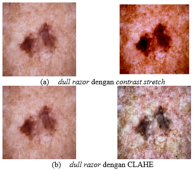
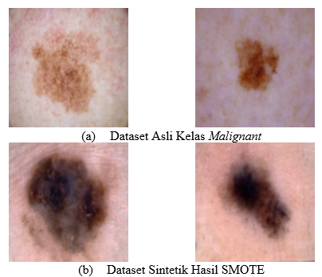

# Komparasi Hasil Klasifikasi Kanker Kulit dengan CNN dan Image Processing

## Abstrak
Di Indonesia, kanker kulit merupakan salah satu jenis kanker yang paling sering terdiagnosis setelah kanker rahim dan kanker payudara. Setiap tahun, insiden kanker kulit terjadi sekitar 5,9-7,8% dari semua jenis kanker. Deteksi dini dan diagnosis yang akurat dengan memanfaatkan citra jaringan kanker pasien yang diolah oleh sistem komputasi yang cepat sangat penting.  Model klasifikasi terbaik yang dikembangkan oleh penulis menunjukkan nilai akurasi sebesar 88.54% dengan pengolahan citra berupa dull razor filtering saja. Hasil ini mengindikasikan bahwa metode yang digunakan berhasil mengklasifikasikan kanker kulit benign dan malignant.

## Metodologi Penelitian
Dalam penelitian ini, digunakan data citra epidermis kulit dengan ukuran seragam 224x224 piksel. Citra yang diteliti terbagi ke dalam dua folder, yaitu train dan test, di mana pada masing-masing folder terdapat dua subfolder yang merepresentasikan kelas yang akan diklasifikasikan: benign dan malignant. Pada folder train, kelas benign terdiri atas 1440 gambar dan kelas malignant terdiri dari 1197 gambar, sedangkan pada folder test, kelas benign terdiri atas 250 gambar dan kelas malignant terdiri dari 300 gambar. 

### Image Preprocessing
Pada penelitian ini diterapkan tiga metode untuk memproses citra, yaitu dull razor filtering, contrast stretching, dan contrast limited adaptive histogram equalization (CLAHE). 

Dull Razor Filtering berfungsi untuk menghilangkan noise atau gangguan pada pixel. Metode contrast stretching berfungsi untuk meningkatkan kontras atau dinamika range nilai pixel. Metode CLAHE berfungsi untuk meningkatkan kontras pada gambar yang memiliki distribusi nilai pixel yang tidak merata sehingga gambar menjadi lebih detail.

### Dataset Preparation
Pada data train, kelas benign terdiri atas 1440 gambar sedangkan kelas malignant terdiri dari 1197 gambar. Jumlah data yang tidak seimbang ini dapat mempengaruhi performa model machine learning [1]. Untuk menangani dataset yang tidak seimbang, pada penelitian ini digunakan metode SMOTE. 

Dalam pengembangan model machine learning, dilakukan pula augmentasi data untuk meningkatkan keragaman data training, mencegah overfitting, dan meningkatkan generalisasi model sehingga dapat memiliki performa baik pada data baru yang tidak terlihat

### Modelling
Model yang digunakan untuk mengklasifikasi kanker kulit pada penelitian ini akan dikembangkan menggunakan metode Convolutional Neural Network (CNN) dengan arsitektur GoogLeNet [2]

### Evaluasi
Untuk melihat keberhasilan model yang dirancang, pengukuran dilakukan pada beberapa parameter, termasuk akurasi, loss, presisi, recall, dan F1-score.

|                       |              |     Nilai Sebenarnya    |              |
|:---------------------:|:------------:|:-----------------------:|:------------:|
|                       |              |           TRUE          |     FALSE    |
|     Nilai Prediksi    |      TRUE    |            TP           |       FP     |
|                       |     FALSE    |            FN           |       TN     |

Keterangan:
-   True Positive (TP) adalah jumlah dataset positif yang diklasifikasikan sebagai positif, 
-   True negative (TN) adalah jumlah dataset negatif yang diklasifikasikan sebagai negatif.
-   False positive (FP) adalah jumlah dataset negatif yang diklasifikasikan sebagai positif.
-   False negative (FN) adalah jumlah dataset positif yang diklasifikasikan sebagai negatif.

## Hasil dan Pembahasan
Pada tahap image preprocessing, citra epidermis kulit diproses menggunakan tiga metode dengan rincian dull razor filtering, dull razor filtering dengan contrast stretching, serta dull razor filtering dengan CLAHE. 

Untuk mengatasi data yang imbalance, digunakan metode SMOTE yang menciptakan sampel sintetik berupa kombinasi linear dari dua sampel dari kelas minor. 

Selanjutnya, dataset diaugmentasi dan  digunakan untuk pelatihan model CNN dengan arsitektur GoogLeNet. Model akan mengklasifikasikan data ke dalam dua kelas, yaitu benign dan malignant. Perbandingan hasil klasifikasi berdasarkan perbedaan perlakuan di proses praproses data terlihat pada Tabel berikut.

|     Karakteristik Citra                 |     Accuracy(%)    |     Presisi(%)    |     Sensitivity(%)    |
|-----------------------------------------|--------------------|-------------------|-----------------------|
|     Tanpa   Praproses                   |     85.27%         |     88%           |     87%               |
|     Dull Razor                          |     88.54%         |     88%           |     88%               |
|     Dull Razor + Contrast Stretching    |     85.63%         |     87%           |     87%               |
|     Dull Razor + CLAHE                  |     85.63%         |     86%           |     86%               |

## Referensi
[1] J. Brownlee, “Imbalanced Classification with Python,” Mach. Learn. Mastery, hal. 463, 2020.
[2] S. Sa’idah, I. Putu, Y. Nugraha Suparta, dan E. Suhartono, “Modification of Convolutional Neural Network GoogLeNet Architecture with Dull Razor Filtering for Classifying Skin Cancer,” J. Nas. Tek. Elektro dan Teknol. Inf. |, vol. 11, no. 2, hal. 148–153, 2022.